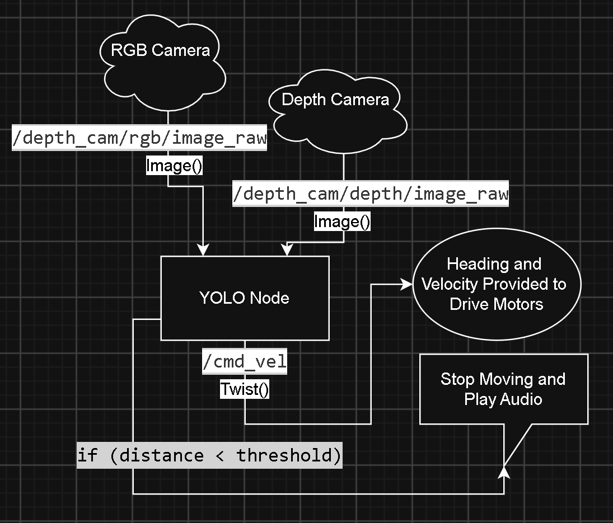

# foxy-robotics

This project was created by myself and two of my classmates (Hannah Jasper and Will Hunt) at Colorado School of Mines for the "Lab 5: Make Something Cool" assignment in MEGN 441. 

It enables a HIWONDER Jetson robot (when equipped with a speaker) to track the closest person it can find, follow them until it reaches approx. 1 meter distance, and then play an audio clip (in our case, the withered foxy jumpscare from Five Nights at Freddy's 2)

We were unable to add the speaker (A JBL Flip) via bluetooth, so we used a USB-C to USB-C cable to plug it into the robot directly.

Manual Pages: https://docs.hiwonder.com/projects/JetRover/en/jetson-orin-nano/docs/1.Quick_Start_Guide.html

Robot Link: https://www.hiwonder.com/products/jetrover?variant=41198996422743

CV Model Link: https://github.com/J3lly-Been/YOLOv8-HumanDetection

# Startup instructions

## Startup + Connection Procedure (using NoMachine):
- turn robot on (switch is the silver button on the chassis)
- connect to hotspot (working is HW25029764, pw: hiwonder)
 - - TODO: find a way to change this? 
- open your NoMachine client (install from https://www.nomachine.com/)
- select your client from the listed, login (un:ubuntu, pw: ubuntu)
 - - Note: You can only have one client connected!
 - - Note: You have a couple seconds latency(?)
- You now should have windowed access!

## Startup + conneciton Procedure (ssh)
- turn robot on (switch is the silver button on the chassis)
- connect to hotspot (working is HW25029764, pw: hiwonder)
- - TODO: find a way to change this?
- open a command line interface (powershell work on windows, bash on linux)
- run the command "ssh -Y ubuntu@<your_ip>" and when asked for the password enter "ubuntu"
- You are now shelled in!

## Startup + connection (wired)
- turn robot on (switch is the silver button on the chassis)
- plug your computer into the usb port on the Jetson, below the screen
- open a command line interface (powershell work on windows, bash on linux)
- run the command "ssh -Y ubuntu@<your_ip>" and when asked for the password enter "ubuntu"
- you are now shelled in!

# Speaker Connection Instructions
- ensure your speaker is on and plugged into one of the USB-C ports on the jetson
- Enter the ubuntu audio menu in the top right of the touchscreen and select your speaker as the audio output device
- - TODO: find a way to do this via command line?

# Runtime Instructions
## Activation Instructions
**Note: This can now be done with a launchfile, see next section if you dont want the gory details** 
- Open two ssh'ed terminals (see prior instructions), refered to as T1 and T2

- In T1 from the directory LAB5-FOXY-ROBOTICS: "colcon build"
- - this builds the source code and allows it to run

- In both T1 and T2: "source install/setup.bash"
- - this makes it so that the terminals have the most up-to-date understanding of what has been built and where it lives

- In T1: "ros2 run control arm_node"
- - This runs the node responsible for moving the arm into position for the CV node and returning the arm to its resting position when done

- In T2: "ros2 run cv yolo_depth_node"
- - This spins up the CV node and makes the robot functional

## Launchfile instructions
- Open 1 terminal
- run "ros2 launch cv run.launch.py"
 - This will move the arm to the correct position and start the following behavior through a single entrypoint

## Deactivation Instructions
- This assumes the robot has been activated

- In T2 press CTRL + C to stop the node

- In T1 press CTRL + C to return the arm to the start position and stop the node

**OR**

- In the terminal wher eyou ran the launchfile, press CTRL + C to stop it all!

# Explanation of Function

This is a YOLO (You Only Look Once) CV model with a ROS2 skeleton enabling it to take input from a RGBD camera and transform this into distance and heading information that is then turned into motion.

From here, the node internally extracts the bounding box associated with the closest human and determines a centroid pixel. Depth information can be extracted for this pixel, and heading information can be extracted by using the position of the centroid pixel relaive to the middle pixel in the feed (whoch is directly in front of the robot). 

This information is then fed into a simple P-controller and translated into the Twist message type resulting in motion. 

To change the audio clip played, replace the contents of cv/cv/sream.mp3 or change the value of self.audio in cv/cv/yoloNodeDepth.py

# Package Information

## control
- This package is resposible for moving the robot's arm from the default position to one where the camera has a good view
- - This is important because the robot needs to have a good view of its environment for the CV model powering the following behavior to work

## cv
- this package is responsible for the CV model, which in turn is responsible for all following behaviors
- - Without this package, the robot doesnt actually do anything

## Info
- this folder holds notes taken during devleopment and was kept for posterity